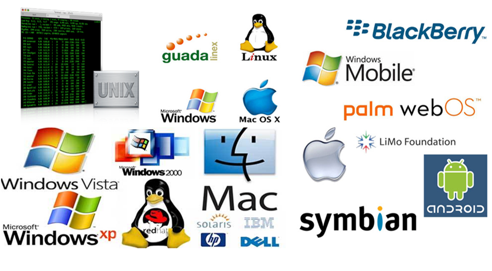

## Administración de sistemas operativos - Curso 19/20

## Temario:
1. Acceso Remoto. :satellite:
   * [A1: Acceso remoto VNC](u1/a1/README.md)
   * [A2: Acceso remoto SSH](u1/a2/README.md)
2. Servidor de impresión. :page_facing_up:
   * [A1.a: Servidor impresión Windows](u2/a1/README.md)
3. Integración de sistemas. :cyclone:
   * [A1: Recursos SMB/CIFS (OpenSUSE)](u3/a1/README.md)
4. ¿?
5. ¿?
6. ¿?
7. ¿?

---
Estamos probando como funciona

> Veamos como funciona esto.

Estamos en clase de ADD:

~~~ bash
git clone
~~~

