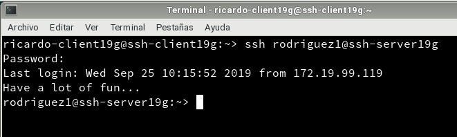
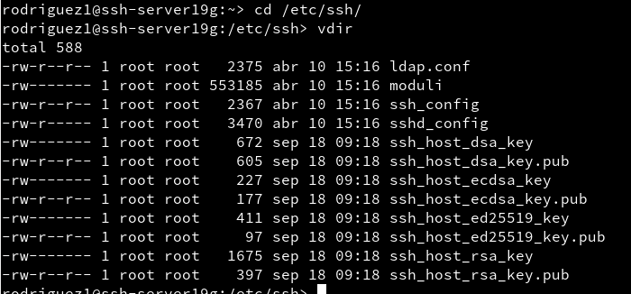

## Instalación del servicio SSH
En el caso que en nuestro equipo no tuviéramos instalado el servicio ssh podríamos instalarlo a través de yast o desde el terminal con el comando `zypper install openssh`.

Una vez instalado comprobaremos que el servicio ssh esta activo a través de la consola con el comando `systemctl status sshd`.

### Primera conexión SSH desde cliente GNU/Linux (2.2)
Para realizar la primera conexión primero haremos unas pequeñas comprobaciones para ver si tenemos conexión con el servidor desde el cliente.

Para ello primero ejecutaremos un `ping` y luego un `nmap` a la ip del servidor. al realizar el `nmap` el puerto 22 deberá aparecer entre los puertos que escucha el server, en el caso contrario deberíamos permitirlo en el cortafuegos.

Una vez hecha esta comprobación vamos a conectarnos por primera vez desde el cliente al servidor ssh para ello pondremos **nombre-del-usuario@nombre-del-host**, por ejemplo, en nuestro caso sera, **rodriguez1@ssh-server19g**.

Vemos que al ser la primera vez que se conecta nos muestra el fingerprint del servidor y nos pregunta si el ordenador al que vamos a conectarnos es confiable y realmente queremos conectarnos. Al conectarnos por segunda vez no aparecerá la confirmación puesto que ya esa clave es conocida.

### Primera conexión SSH desde cliente Windows
Como windows no tiene ninguna herramienta para conectarse a SSH deberemos instalar una llamada PuTTY.

Una vez instalado vamos a comprobar que desde el sistema windows tenemos conexión con el servidor ssh, para ello vamos a realizar un ping a la ip del mismo.

Una vez realizado el ping y comprobado que tenemos conexión con el servidor vamos a iniciar por primera vez la conexión ssh con el servidor, para ello ponemos el nombre de host.

Vemos que como en el caso de OpenSuse también nos pide que confirmemos si este ordenador es confiable y si queremos conectarnos con el.

Una vez realizado el proceso anterior nos conectara con el servidor ssh y nos pedirá el usuario con el queremos acceder y la contraseña.

A partir de este momento ya no necesitamos la confirmación del fingerprint puesto que ya esta en la lista de ordenadores conocidos.

## Cambiamos la identidad del servidor

Comprobamos que existen los ficheros `ssh_host*key` y `ssh_host*key.pub` en la carpeta `/etc/ssh`.

Vamos a modificar el fichero `/etc/ssh/sshd_config`, comentaremos todas las lineas de configuración HostKey y dejaremos sin comentar la línea `HostKey etc/ssh/host_host_rsa_key`. Ahora con este cambio solo usaremos claves tipo RSA.

### Regenerar certificados

Para volver a generar las claves publicas/privada, como usuario root ejecutaremos la instrucción `ssh-keygen -t rsa -f /etc/ssh/ssh_host_rsa_key`.

En nuestro caso no le hemos puesto ninguna contraseña a las nuevas claves.

Después de realizar dicho cambio reiniciamos el servicio.

### Comprobar cambio de clave servidor ssh (3.2)

Ahora vamos a comprobar que sucede al intentar conectarnos desde el cliente con los usuarios 1 y 4 al servidor por ssh.

Vemos que nuestro cliente no puede conectar por ssh al servidor debido a que los certificados antes compartidos han cambiado en el servidor. En el propio mensaje de error nos dice como arreglar el problema, con la instrucción `ssh-keygen -R ssh-server19g -f /home/ricardo/.ssh/known_host`.

Tras ejecutar el comando nos muestra un mensaje informándonos de que el archivo known_host ha sido modificado y que tenemos una copia original sin modificar que se llama known_hosts.old

Ahora vamos a comprobar si podemos conectar nuevamente con nuestro servidor.

Vemos que ahora nos pide dos mensajes de confirmación, uno es añadiendo la IP con la nueva clave RSA y pidiéndonos confirmar para continuar.

Comprobamos que ocurre en Windows.

Nos dice que la clave a cambiado, y nos pide si queremos confiar, si queremos continuar sin confiar o no continuar ni confiar. En nuestro caso le daremos a si.

Al darle si este modifica los certificados y permite la conexión confiable.

## Personalizando el Prompt Bash

Vamos a cambiar el prompt del cliente cuando nos conectamos Vía SSH con el cliente rodriguez1 para ello escribiremos en el archivo `/home/rodriguez1/.bashrc`

~~~
if [ -n "$SSH_CLIENT" ]; then
   PS1="AccesoRemoto_\e[32m\u@\h:\e[0m \w\a\$ "
else
   PS1="\[$(pwd)\]\u@\h:\w>"
fi
~~~

Guardamos los cambios, ademas incluiremos un archivo llamado alias en la ruta `/home/rodriguez1/.alias` y escribiremos el siguiente contenido.

~~~
alias c='clear'
alias g='geany'
alias p='ping'
alias v='vdir -cFl'
alias s='ssh'
~~~

Guardamos el archivo y vamos a conectarnos vía ssh desde nuestro cliente al servidor con el usuario rodriguez1 y comprobamos los cambios realizaros.

Vemos que los cambios han tenido efecto siendo el prompt el que hemos puesto y el alias que hemos probado a sido el del ping.

## Autentificación mediante claves públicas (5)

Desde el usuario Ricardo vamos a generar unas nuevas claves públicas RSA.

Ahora estas claves vamos a copiarlas en el usuario Rodriguez4 del servidor, para ello vamos a utilizar el comando `ssh-copy-id rodriguez4@ssh-server19g`

Ahora comprobamos que desde OpenSuse para entrar en este usuario no nos requerirá contraseña mientras que desde Windows si.

Vemos que no nos pide la contraseña para acceder al usuario.

Vemos que desde windows tenemos que poner la contraseña.

## Uso de ssh como tunel para X (6)

Hemos instalado un programa en el servidor que no esta en los clientes (Geany en nuestro caso)

Consultamos el fichero `/etc/ssh/sshd_config` comprobaremos que X11Forwarding este en yes y este sin comentar.

Ahora iremos al cliente y comprobaremos que no tienen instalado el Geany.

Ahora vamos a conectarnos al servidor con el usuario rodriguez1 con el siguiente comando: `ssh -X rodriguez1@ssh-server19g`.

Una vez conectado ejecutamos el programa y vemos como se ejecuta sin tenerlo instalado en el cliente.

## Aplicaciones windows nativas

Ahora vamos a instalar una aplicación de Windows en el servidor para posteriormente usarla en los clientes, para ello vamos a usar el emulador de Wine.

Una vez instalado comprobamos que funciona, wine viene con el notepad de windows así que usaremos esto para la práctica.

Ahora iremos al cliente y nos conectaremos a alguno de los usuarios y comprobamos que funciona desde remoto.

## Restricciones de uso

### Restricción sobre un usuario (8.1)

Para restringir el acceso desde remoto a un usuario deberemos modificar el fichero `/etc/ssh/sshd_config`, En el escribiremos "DenyUsers rodriguez2" (en nuestro caso es este usuario)

Una vez hecho esto guardamos los cambios y comprobamos si podemos acceder desde ssh al servidor.

Tras pedirnos la contraseña repetidas veces nos informara que el acceso esta denegado.

## Restricción sobre una aplicación

Para restringir el acceso a los usuarios a las aplicaciones remotas primero deberemos crear un grupo, lo llamaremos `remoteapps`, ademas uniremos a este grupo el usuario al que NO le queremos restringir el acceso a la aplicación.

Ahora cambiaremos el grupo propietario y los permisos de Geany a 750 (es decir, todo para root, lectura y escritura para miembros del grupo, nada para los usuarios), para hacer esto utilizaremos los comandos `chgrp` y `chmod`.

Ahora comprobaremos el funcionamiento en local.

Vemos que desde el usuario rodriguez1 no nos deja y nos muestra un mensaje de permiso denegado mientras que si usamos el usuario rodriguez4 si que nos permite usar la aplicación.

Ahora vamos a comprobar el funcionamiento vía ssh.

Primero accedemos desde el usuario rodriguez1

Vemos que no nos permite el uso de la aplicación

Ahora probamos desde el usuario rodriguez4

Vemos que nos permite acceder a la aplicación sin problemas
