# Recursos SMB/CIFS (OpenSUSE)

## 1. Servidor Samba(MV1)

### 1.1 Preparativos

Configuramos el nombre del equipo para que sea smb-server19g y el archivo `/etc/hosts` para que las direcciones IP de esos equipos respondan al nombre que le hemos asignado a cada uno.

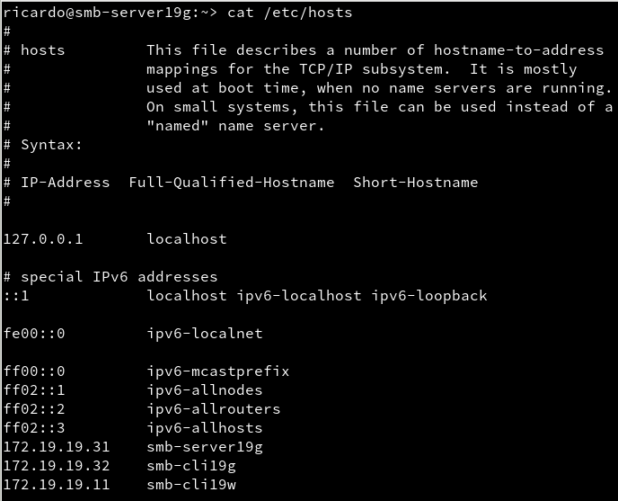

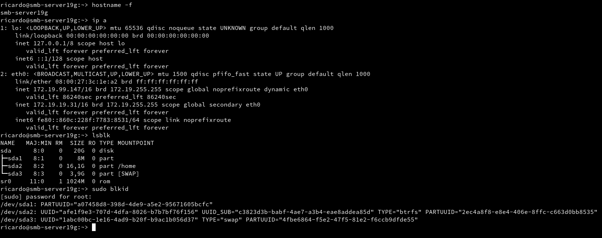

### 1.2 Usuarios locales

Creamos los grupos y usuarios con el siguiente orden:
  - Piratas
    - pirata1
    - pirata2
    - supersamba
  - Soldados
    - soldado1
    - soldado2
    - supersamba
  - Todos
    - pirata1 y pirata2
    - soldado1 y soldado2
    - supersamba
    - smbguest

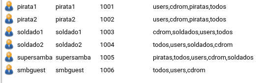

### 1.3 Crear las carpetas para los futuros recursos compartidos

Creamos las carpetas `Public.d`, `castillo.d` y `public.d` les damos el propietario y grupos adecuados y los permisos.

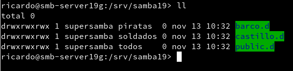

### 1.4 Configurar el servidor Samba

Hacemos una copia de seguridad del fichero de configuración `/etc/samba/smb.conf`

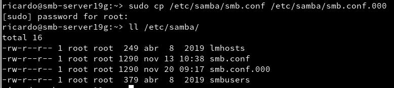

Ahora nos dirigiremos a la configuración del servidor samba y en la pestaña de identidad pondremos que el grupo de trabajo sea 'CURSO1920' y En controlador de dominio elegiremos la opción 'No es un controlador de dominio'

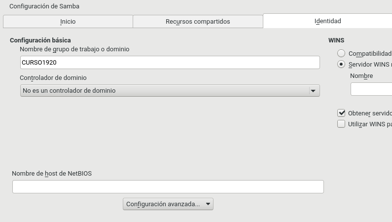

Ahora en la pestaña inicio marcaremos la opción de inicio del servicio 'Durante el arranque' y en la configuración del cortafuegos marcaremos la opción de 'Puerto abierto en el cortafuegos'

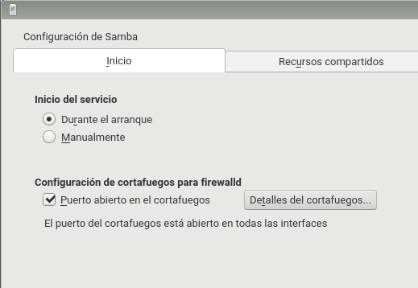

### 1.5 Crear recursos compartidos de Samba

Creamos los recursos compartidos en `Yast > Samba Server > Recursos compartidos` y le configuramos las opciones pertinentes.

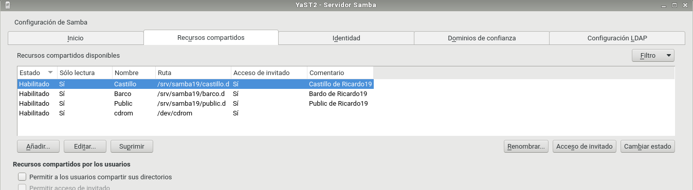

Comprobamos los cambios en el archivo de configuración.

(En este caso no se a usado una captura de pantalla debido a que el archivo es demasiado largo)

``` bash
[global]
	workgroup = CURSO1920
	passdb backend = tdbsam
	printing = cups
	printcap name = cups
	printcap cache time = 750
	cups options = raw
	map to guest = Bad User
	include = /etc/samba/dhcp.conf
	logon path = \\%L\profiles\.msprofile
	logon home = \\%L\%U\.9xprofile
	logon drive = P:
	usershare allow guests = No
	wins support = No
	guest account = smbguest
	netbios name = smb-server19
	security = user
	server string = Servidor de Ricardo19
	wins server =

[Barco]
	comment = Bardo de Ricardo19
	path = /srv/samba19/barco.d
	read only = Yes
	guest ok = Yes
	valid users = pirata1, pirata2

[Castillo]
	comment = Castillo de Ricardo19
	path = /srv/samba19/castillo.d
	read only = Yes
	guest ok = Yes
	valid users = @soldados

[Public]
	comment = Public de Ricardo19
	path = /srv/samba19/public.d
	read only = Yes
	guest ok = Yes

[cdrom]
	guest ok = Yes
	path = /dev/cdrom
	read only = Yes
```

Y comprobamos con el comando `testparm`

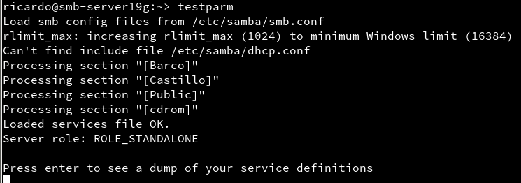

### 1.6 Usuarios Samba

Una vez creados los usuarios en el sistema ahora tenemos que añadirlos al servidor samba para ello utilizaremos el comando `smbpasswd -a USUARIO`

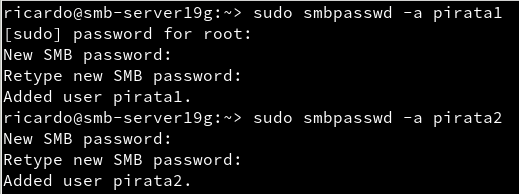

Comprobamos los usuarios creados en samba.

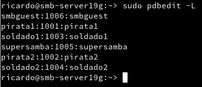
