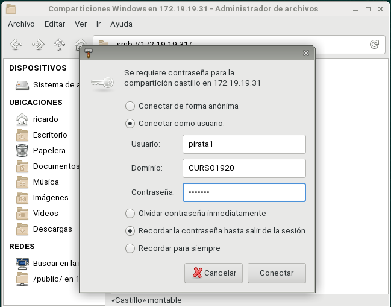
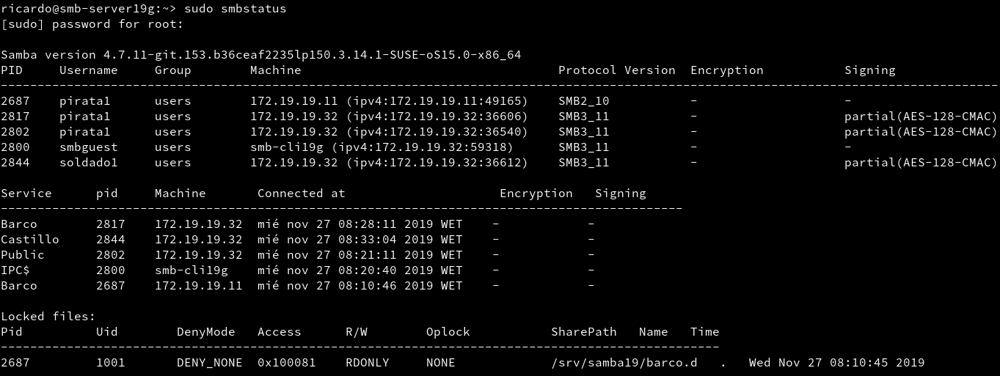

# Recursos SMB/CIFS (OpenSUSE)

## 1. Servidor Samba(MV1)

### 1.1 Preparativos

Configuramos el nombre del equipo para que sea smb-server19g y el archivo `/etc/hosts` para que las direcciones IP de esos equipos respondan al nombre que le hemos asignado a cada uno.


### 1.2 Usuarios locales

Creamos los grupos y usuarios con el siguiente orden:
  - Piratas
    - pirata1
    - pirata2
    - supersamba
  - Soldados
    - soldado1
    - soldado2
    - supersamba
  - Todos
    - pirata1 y pirata2
    - soldado1 y soldado2
    - supersamba
    - smbguest


### 1.3 Crear las carpetas para los futuros recursos compartidos

Creamos las carpetas `Public.d`, `castillo.d` y `public.d` les damos el propietario y grupos adecuados y los permisos.


### 1.4 Configurar el servidor Samba

Hacemos una copia de seguridad del fichero de configuración `/etc/samba/smb.conf`


Ahora nos dirigiremos a la configuración del servidor samba y en la pestaña de identidad pondremos que el grupo de trabajo sea 'CURSO1920' y En controlador de dominio elegiremos la opción 'No es un controlador de dominio'


Ahora en la pestaña inicio marcaremos la opción de inicio del servicio 'Durante el arranque' y en la configuración del cortafuegos marcaremos la opción de 'Puerto abierto en el cortafuegos'


### 1.5 Crear recursos compartidos de Samba

Creamos los recursos compartidos en `Yast > Samba Server > Recursos compartidos` y le configuramos las opciones pertinentes.


Comprobamos los cambios en el archivo de configuración.

(En este caso no se ha usado una captura de pantalla debido a que el archivo es demasiado largo)

``` bash
[global]
	workgroup = CURSO1920
	passdb backend = tdbsam
	printing = cups
	printcap name = cups
	printcap cache time = 750
	cups options = raw
	map to guest = Bad User
	include = /etc/samba/dhcp.conf
	logon path = \\%L\profiles\.msprofile
	logon home = \\%L\%U\.9xprofile
	logon drive = P:
	usershare allow guests = No
	wins support = No
	guest account = smbguest
	netbios name = smb-server19
	security = user
	server string = Servidor de Ricardo19
	wins server =

[Barco]
	comment = Bardo de Ricardo19
	path = /srv/samba19/barco.d
	read only = Yes
	guest ok = Yes
	valid users = pirata1, pirata2

[Castillo]
	comment = Castillo de Ricardo19
	path = /srv/samba19/castillo.d
	read only = Yes
	guest ok = Yes
	valid users = @soldados

[Public]
	comment = Public de Ricardo19
	path = /srv/samba19/public.d
	read only = Yes
	guest ok = Yes

[cdrom]
	guest ok = Yes
	path = /dev/cdrom
	read only = Yes
```

Y comprobamos con el comando `testparm`


### 1.6 Usuarios Samba

Una vez creados los usuarios en el sistema ahora tenemos que añadirlos al servidor samba para ello utilizaremos el comando `smbpasswd -a USUARIO`


Comprobamos los usuarios creados en samba.


### 1.7 Reiniciar

Reiniciamos el servicio `smb` y `nmb`


y comprobamos con los comandos `sudo testparm` y `sudo lsof -i`


## 2. Windows
### 2.1 Cliente Windows GUI

Desde cliente Windows accedemos a los recursos compartidos en el servidor Samba


- Comprobamos la conexión de Castillo usando el comando `net use` desde Windows


Comprobamos desde el Servidor con el comando `smbstatus`


- Comprobamos la conexión de Barco usado el comando `net use` desde Windows.


Comprobamos desde el Servidor con el comando `smbstatus`


- También comprobamos con el comando `lsof -i`


- Comprobamos los recursos del Servidor desde nuestro cliente windows.


- Vamos a crear una conexión con uno de los recursos compartidos y montarlo en un unidad comosi fuera un disco duro.


- Comprobamos la conexión creada con `netuse`


- Comprobamos que podemos crear archivos y carpetas dentro de la carpeta "barco"


## 3. Linux
### 3.1. Cliente GNU/Linux GUI

Comprobamos que podemos acceder a los archivos compartidos de nuestro servidor Samba con la IP del servidor.



Comprobamos a crear carpetas y ficheros en las carpetas `barco` y `castillo`

- Comprobamos que podemos crear carpetas en el servidor Samba desde el cliente, para ello creamos la carpeta`Inventario del barco` y fichero `Distribuciones de cañones` en la carpeta `barco`


- Comprobamos que podemos crear carpetas también en `castillo`, para ello crearemos la carpeta `Inventario` y el fichero `Horario Guardias`


- Comprobamos que la carpeta `public` es solo de lectura


- Comprobamos las conexiones desde el servidor.




### 3.2. Cliente GNU/Linux comandos

Vamos a comprobar si podemos ver los ficheros de Samba. En un principio veremos que no podemos verlo, para ello desactivaremos el firewall por el momento y comprobamos.


Vamos a ver los recursos solo de nuestra maquina en concreto.


Vamos a crear una carpeta local en nuestra maquina cliente para montar allí una de nuestras carpetas compartidas del servidor.


Ahora vamos a montar el recurso compartido en la carpeta creada anteriormente y comprobamos que se ha montado. ¡¡¡OJO!!! este paso hay que hacerlo con usuario `root`


Comprobamos que en la carpeta que hemos montado que están los ficheros de Samba y no esta vacía.


Comprobamos desde el servidor Samba las conexiones.


### 3.3. Montaje automático

- Creamos una instantánea de la máquina virtual


Comprobamos que en el cliente tras el reinicio veremos que el recurso compartido no esta montando.


Ahora vamos a configurar un montaje automático de un recurso compartido.


Reiniciamos la máquina y comprobamos que se monta automáticamente.


Contenido del fichero `/etc/fstab`

``` bash

```
