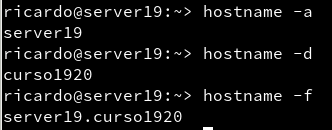
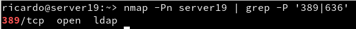

# Servidor 389-DS - OpenSuse

## 1. Prerequisitos
### 1.1. Nombre de Equipo FQDN

- Configuramos la máquina dandole el hostname ***server19.curso1920*** y configuramos el fichero `/etc/hostname` y `/etc/hosts` y comprobamos.

### 1.2. Abrir puertos requeridos de firewall

Ahora abriremos los puertos necesarios para la práctica.

## 2. Instalar el Servidor LDAP
### 2.1 Instalación del paquete

Instalamos el script para instalar luego el LDAP.

Ahora ejecutaremos el script para instalar LDAP.

~~~
server19:~ # /usr/sbin/setup-ds.pl

==============================================================================
This program will set up the 389 Directory Server.

It is recommended that you have "root" privilege to set up the software.
Tips for using this  program:
  - Press "Enter" to choose the default and go to the next screen
  - Type "Control-B" or the word "back" then "Enter" to go back to the previous screen
  - Type "Control-C" to cancel the setup program

Would you like to continue with set up? [yes]: yes

==============================================================================
Choose a setup type:

   1. Express
       Allows you to quickly set up the servers using the most
       common options and pre-defined defaults. Useful for quick
       evaluation of the products.

   2. Typical
       Allows you to specify common defaults and options.

   3. Custom
       Allows you to specify more advanced options. This is
       recommended for experienced server administrators only.

To accept the default shown in brackets, press the Enter key.

Choose a setup type [2]: 2

==============================================================================
Enter the fully qualified domain name of the computer
on which you're setting up server software. Using the form
<hostname>.<domainname>
Example: eros.example.com.

To accept the default shown in brackets, press the Enter key.

Warning: This step may take a few minutes if your DNS servers
can not be reached or if DNS is not configured correctly.  If
you would rather not wait, hit Ctrl-C and run this program again
with the following command line option to specify the hostname:

    General.FullMachineName=your.hostname.domain.name

Computer name [server19]: server19.curso1920

==============================================================================
The server must run as a specific user in a specific group.
It is strongly recommended that this user should have no privileges
on the computer (i.e. a non-root user).  The setup procedure
will give this user/group some permissions in specific paths/files
to perform server-specific operations.

If you have not yet created a user and group for the server,
create this user and group using your native operating
system utilities.

System User [dirsrv]: dirsrv
System Group [dirsrv]: dirsrv

==============================================================================
The standard directory server network port number is 389.  However, if
you are not logged as the superuser, or port 389 is in use, the
default value will be a random unused port number greater than 1024.
If you want to use port 389, make sure that you are logged in as the
superuser, that port 389 is not in use.

Directory server network port [389]: 389

==============================================================================
Each instance of a directory server requires a unique identifier.
This identifier is used to name the various
instance specific files and directories in the file system,
as well as for other uses as a server instance identifier.

Directory server identifier [server19]: ldap19

==============================================================================
The suffix is the root of your directory tree.  The suffix must be a valid DN.
It is recommended that you use the dc=domaincomponent suffix convention.
For example, if your domain is example.com,
you should use dc=example,dc=com for your suffix.
Setup will create this initial suffix for you,
but you may have more than one suffix.
Use the directory server utilities to create additional suffixes.

Suffix [dc=curso1920]: dc=ldap19,dc=curso1920

==============================================================================
Certain directory server operations require an administrative user.
This user is referred to as the Directory Manager and typically has a
bind Distinguished Name (DN) of cn=Directory Manager.
You will also be prompted for the password for this user.  The password must
be at least 8 characters long, and contain no spaces.
Press Control-B or type the word "back", then Enter to back up and start over.

Directory Manager DN [cn=Directory Manager]: cn=Directory Manager
Password:
Password (confirm):
Traceback (most recent call last):
  File "/usr/sbin/ds_selinux_enabled", line 16, in <module>
    import selinux
ImportError: No module named selinux
Your new DS instance 'ldap19' was successfully created.
Exiting . . .
Log file is '/tmp/setupif75ee.log'
~~~

### 2.2. Comprobamos el servicio

- Habilitamos el servicio para que inicie al iniciar el equipo y comprobamos si esta activo.

- Comprobamos si LDAP es accesible desde la red.

### 2.3. Comprobamos el acceso al contenido LDAP

Comprobamos el acceso al contenido

## 3. Añadir usuarios LDAP por comandos
### 3.1. Buscar Unidades Organizativas

Comprobamos que esten creadas las OU People y Groups.

### 3.2. Agregar usuarios

Para agregar usuarios en `LDAP` tenemos que usar los ficheros `LDIF` para ello vamos a crear un fichero `LDIF` para un usuario llamado Mazinger.

Ahora vamos a agregarlo a la base de datos.

### 3.3. Comprobar el nuevo usuario

Vamos a comprobar que el usuario se ha creado correctamente.

> ***Eliminar usuario del árbol del directorio***
> * Creamos un fichero Mazinger-delete.ldif
>
> 
>
> * Ahora como en la creación ejecutaremos el fichero.
>
> 

## 4. Contraseñas Encriptadas

### 4.1. Herramienta slappasswd

Esta herramienta la usaremos para generar contraseñas encriptadas para nuestros usuarios de LDAP.

Su uso es muy sencillo, pondremos la contraseña y nos generara la contraseña encriptada, la copiaremos y la pegaremos en el archivo `LDIF` de creación de usuario indicando el método de encriptado(el método de encriptado viene al principio de la contraseña entre llaves.).

### 4.2. Agregar más usuarios

Vamos a crear 3 nuevos usuarios en LDAP con clave encriptada usando el método anterior.

Crearemos los siguientes usuarios:

|Full Name|Login Acount|uid|
|---------|------------|---|
|Kojo Kabuto|koji|2002|
|Boss|boss|2003|
|Doctor Infierno|drinfierno|2004|

- Primero crearemos los archivos `LDIF` de los usuarios con las características anteriores.

- Koji

- Boss

- Doctor Infierno

Una vez creados los ficheros `LDIF` agregaremos los usuarios.

Ahora comprobamos desde un cliente que los usuarios se han creado correctamente.

