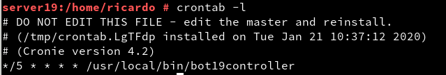

### Servicio de comunicaciones con Telegram

#### 1.4. Bot Funcionando

[Script](src/bot19d)

Video: https://youtu.be/tV5KQPrne7o

#### 2.4. Condiguración del Servicio

[Script](src/bot19.service)

Systemctl:

- Start

- Stop

#### 3.2. Tareas Programadas
[Script](src/bot19controller)

Tarea Programada:
Deberemos entrar como super usuario para crear la tarea programada.

creamos la tarea programada

