### Vagrant con Virtual Box

#### 3.3. Comprobar proyecto 1
Iniciando la máquina virtual

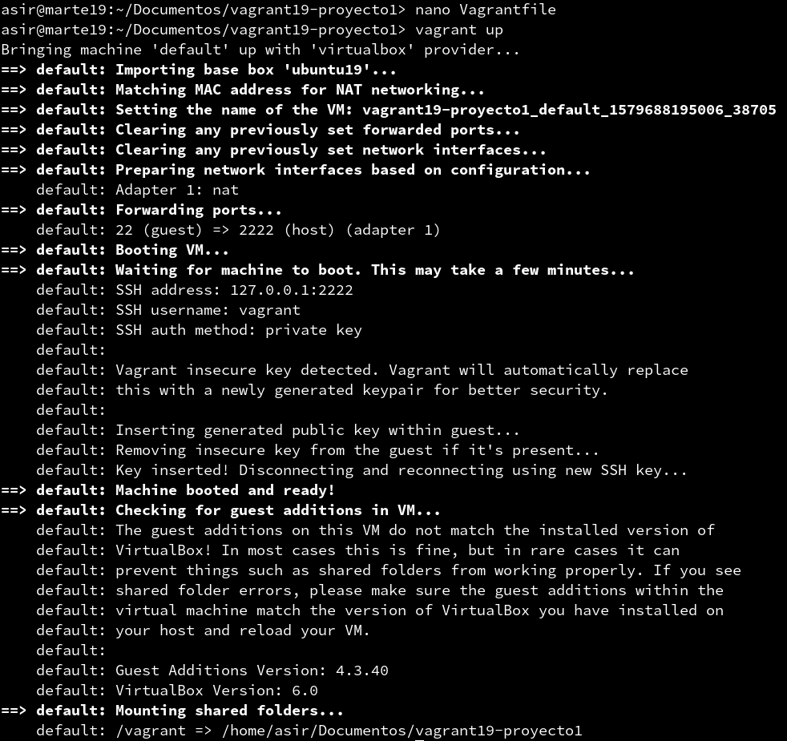

Conectandome a la máquina ssh

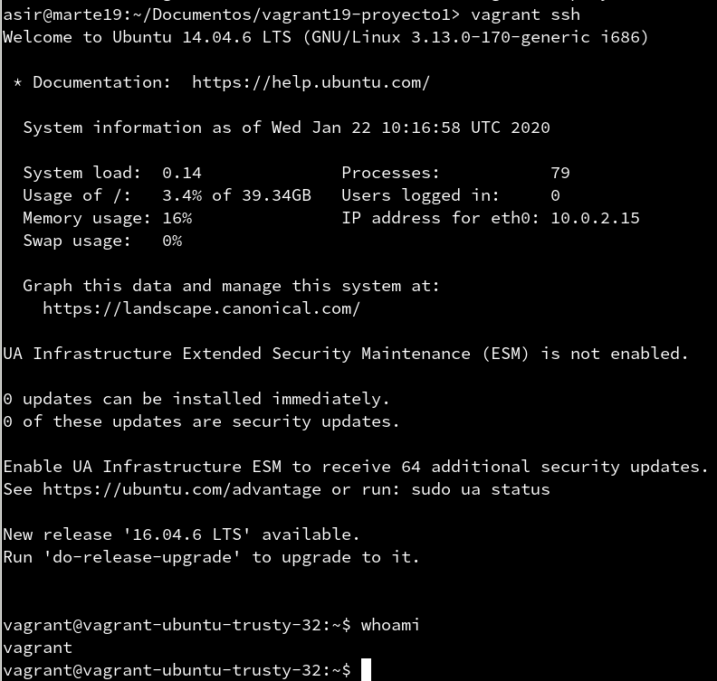

Resultado de la máquina en virtualbox

#### 5.2. Comprobar proyecto 2
Vagrantfile

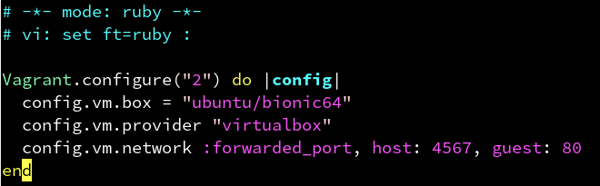

Puertos que esta usando Vagrant

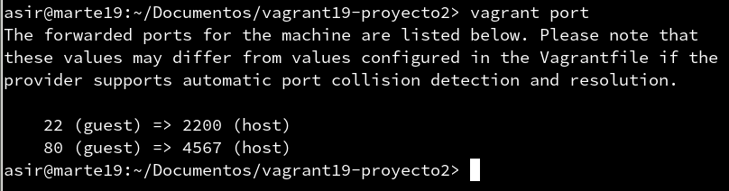

Resultado de la web que hemos creado en Vagrant

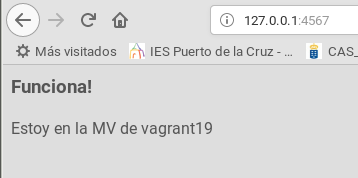

#### 6.1 Suministro Shell Script - Proyecto 3
VagrantFile

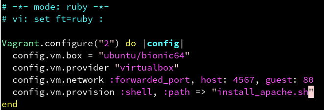

Script usado

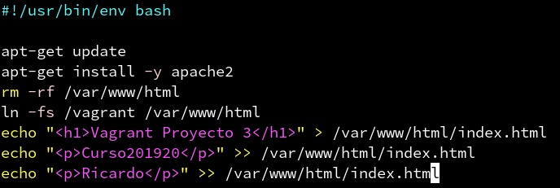

Resultado

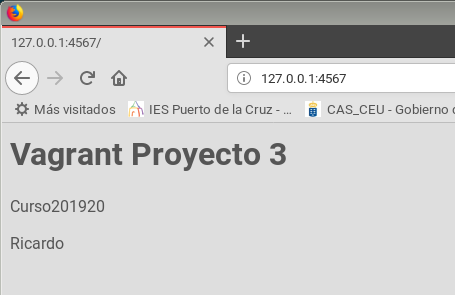

#### 7.2 Crear Box Vagrant - Proyecto 4

Vagrantfile

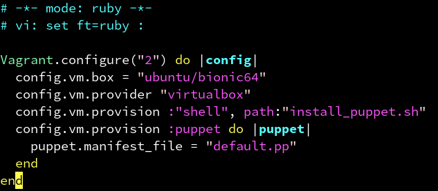

Instalación Puppet

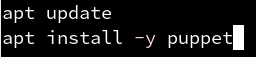

Default.pp

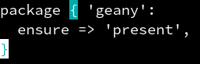

Resultado

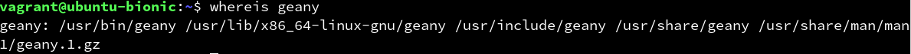

#### 7.2 Crear box Vagrant

Package.

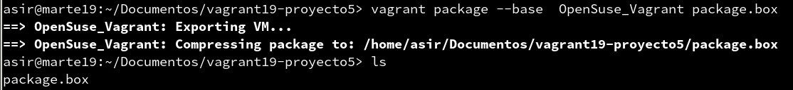

Añadiendo al repositorio

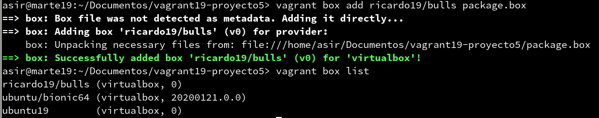

VagrantFile

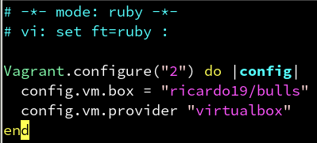

Levantando la máquina.

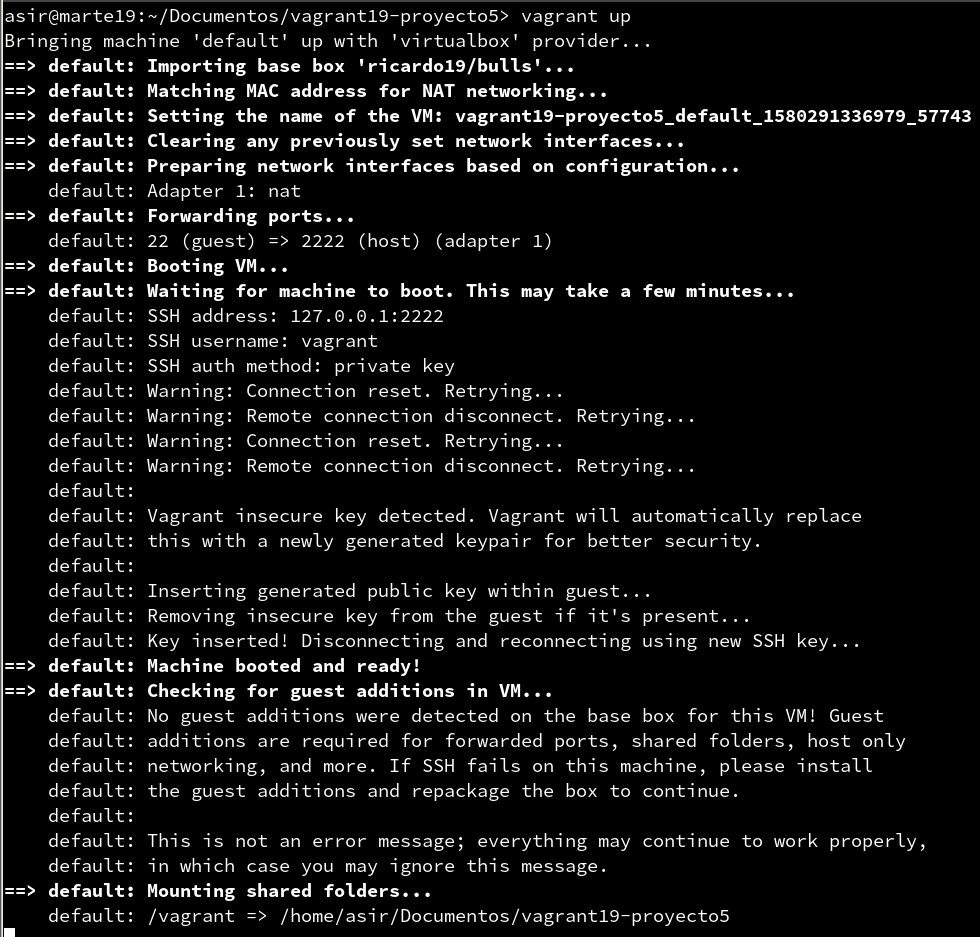

Conectando a la máquina.

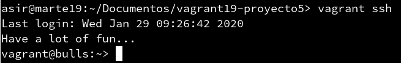
