### 1. Salt-Stack

Salt-stack es una herramienta de tipo de gestor de infraestructura.

### 2. Preparativos

| Config   | MV1          | MV2          |
|----------|--------------|--------------|
| Alias    | Master       | Minion       |
| Hostname | master19g    | minion19g    |
| SO       | OpenSUSE     | OpenSUSE     |
| IP       | 172.19.19.31 | 172.19.19.32 |

### 3. Master: Instalar y configurar

Instalaremos el Salt-Stack Master en la MV1

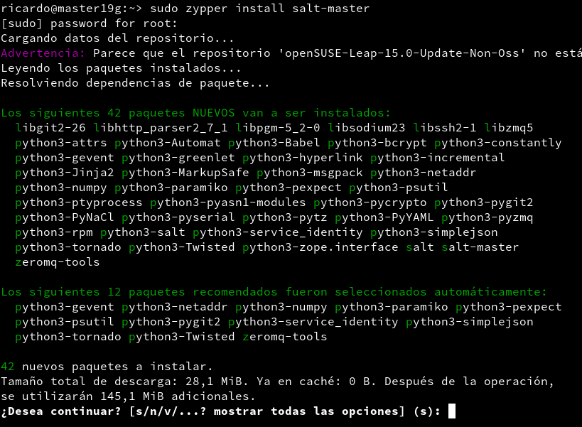

Vamos a modificar el fichero `/etc/salt/master` para configurar nuestro master.

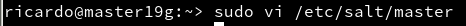
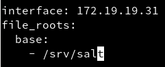

Activamos el servicio para que arranque con el sistema y lo iniciamos si no estuviera ya iniciado.

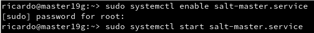

Comprobamos los minions aceptados por nuestro master, de momento no debería aparecer ninguno.

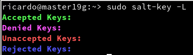

### 4. Minion
#### 4.1. Instalación y configuración

Instalar Salt-Stack Minion en la MV2

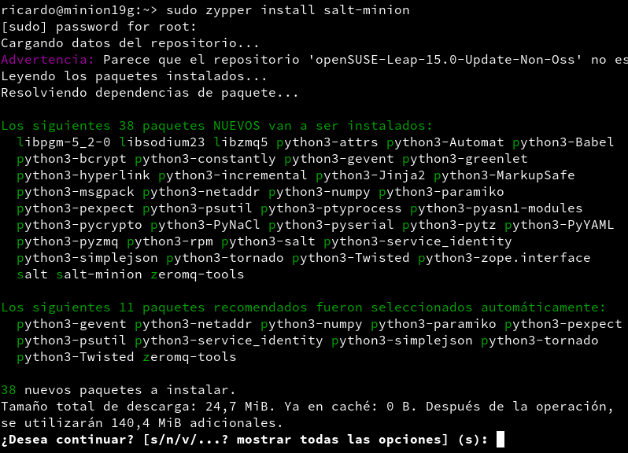

Modificamos el fichero `/etc/salt/minion` para definir el master

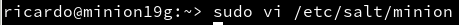
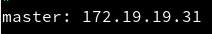

Habilitamos el servicio y lo iniciamos.


comprobamos que el apache2 no esta instalado en el minion.

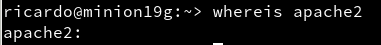

#### 4.2. Aceptación desde el Master

Comprobamos que el master tiene una petición de nuestro minion.

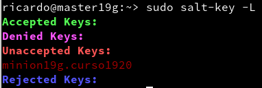

Aceptamos la petición y comprobamos la lista y comprobamos si ahora nuestro minion esta aceptado.

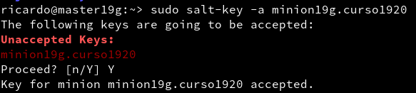

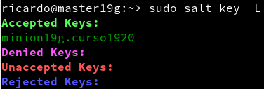

#### 4.3. Comprobar conectividad

Comprobamos la conectividad entre el master y el minion.

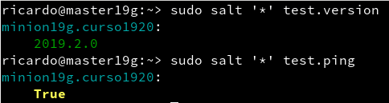

### 5. Salt States
#### 5.1. Preparar el directorio para los estados

En el master vamos a crear los directorios para guardar los estados de Salt.

Crearemos los directorios `/srv/salt/base` y `/srv/salt/devel`

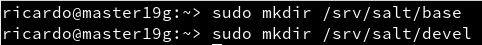

crearemos el fichero `/etc/salt/master.d/roots.conf` para que Salt tenga en cuenta nuestros nuevos directorios de estado.

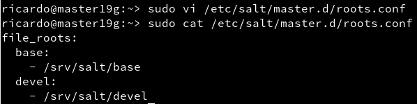

```
- base = Guardar nuestros estados
- devel = para desarrollo o pruebas.
```

#### 5.2. Crear un nuevo estado

Vamos a crear un nuevo estado para ello crearemos el fichero `/svr/salt/base/apache/init.sls` con el siguiente contenido:

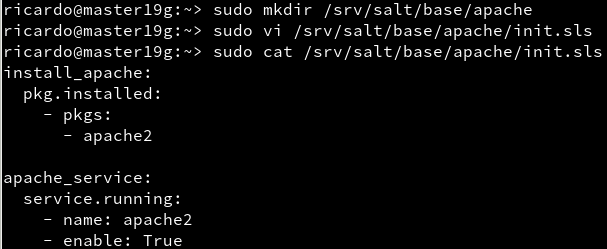

#### 5.3. Asociar Minions a estados

Vamos a asociar todos los Minions al estado que acabamos de crear para ello tendremos que crear el fichero `/srv/salt/base/top.sls` con el siguiente contenido:

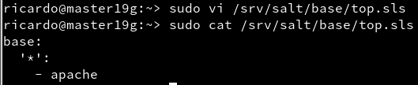

#### 5.4. Comprobar: estados definidos

Consultamos los estados que hemos definido para cada Minion

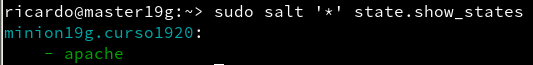

#### 5.5. Aplicar el nuevo estado

Comprobamos que no tengamos errores en las definiciones.

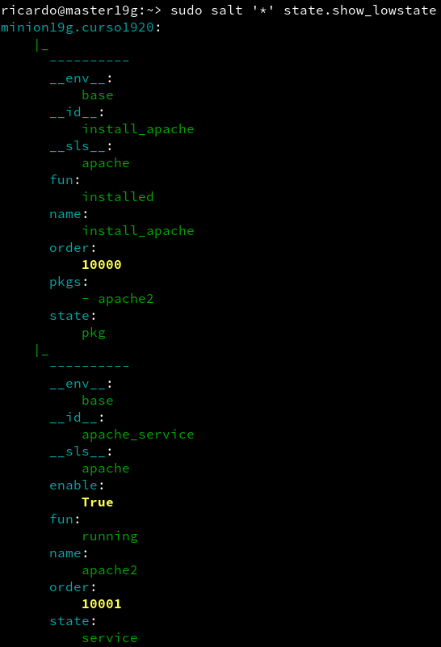
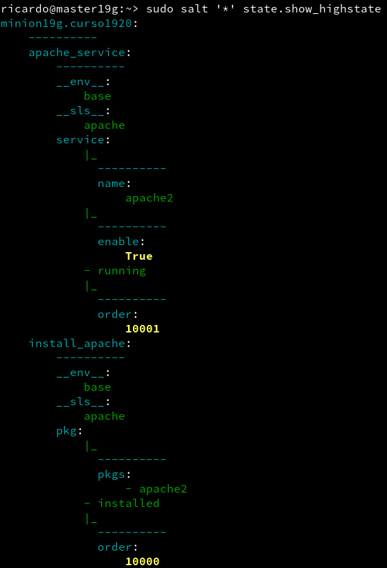

Una vez comprobado que no tenemos ningún error aplicamos el estado.

[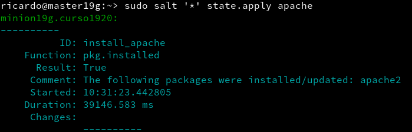](src/state.apply)


### 6. Crear estado "users"

### 7. Añadir minion.
