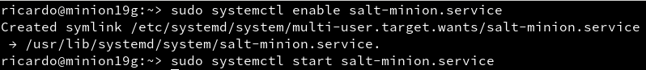

### 1. Salt-Stack

Salt-stack es una herramienta de tipo de gestor de infraestructura.

### 2. Preparativos

| Config   | MV1          | MV2          |
|----------|--------------|--------------|
| Alias    | Master       | Minion       |
| Hostname | master19g    | minion19g    |
| SO       | OpenSUSE     | OpenSUSE     |
| IP       | 172.19.19.31 | 172.19.19.32 |

### 3. Master: Instalar y configurar

Instalaremos el Salt-Stack Master en la MV1


Vamos a modificar el fichero `/etc/salt/master` para configurar nuestro master.


Activamos el servicio para que arranque con el sistema y lo iniciamos si no estuviera ya iniciado.


Comprobamos los minions aceptados por nuestro master, de momento no debería aparecer ninguno.


### 4. Minion
#### 4.1. Instalación y configuración

Instalar Salt-Stack Minion en la MV2


Modificamos el fichero `/etc/salt/minion` para definir el master


Habilitamos el servicio y lo iniciamos.



comprobamos que el apache2 no esta instalado en el minion.


#### 4.2. Aceptación desde el Master

Comprobamos que el master tiene una petición de nuestro minion.


Aceptamos la petición y comprobamos la lista y comprobamos si ahora nuestro minion esta aceptado.


#### 4.3. Comprobar conectividad

Comprobamos la conectividad entre el master y el minion.


### 5. Salt States
#### 5.1. Preparar el directorio para los estados

En el master vamos a crear los directorios para guardar los estados de Salt.

Crearemos los directorios `/srv/salt/base` y `/srv/salt/devel`


crearemos el fichero `/etc/salt/master.d/roots.conf` para que Salt tenga en cuenta nuestros nuevos directorios de estado.


```
- base = Guardar nuestros estados
- devel = para desarrollo o pruebas.
```

#### 5.2. Crear un nuevo estado

Vamos a crear un nuevo estado para ello crearemos el fichero `/svr/salt/base/apache/init.sls` con el siguiente contenido:


#### 5.3. Asociar Minions a estados

Vamos a asociar todos los Minions al estado que acabamos de crear para ello tendremos que crear el fichero `/srv/salt/base/top.sls` con el siguiente contenido:


#### 5.4. Comprobar: estados definidos

Consultamos los estados que hemos definido para cada Minion


#### 5.5. Aplicar el nuevo estado

Comprobamos que no tengamos errores en las definiciones.


Una vez comprobado que no tenemos ningún error aplicamos el estado.

[](src/state.apply)

Click sobre la imagen para ver el resultado completo

Comprobamos que el apache2 ha sido instalado.


### 6. Crear más estados
#### 6.1. Crear estado "users"

Vamos a crear el fichero `/srv/salt/base/users/init.sls`


Dentro del fichero crearemos las definiciones para el grupo `mazingerz` y los usuarios `koji19` y `drinfierno19` en dicho grupo.


Asociaremos el estado a todos los minions para que podamos aplicarlo.


Aplicamos el estado.

[](src/users_state.apply)

Click en la imagen para ver todo el resultado.

Comprobamos en el minion que el grupo y los usuarios se han creado.


#### 6.2. Crear estado "directories"

Vamos a crear un estado para crear los directorios `private`(700), `public`(755) y `group`(750) en el home del usuario `Koji19`

Primero deberemos crear el directorio `/srv/salt/base/directories`


Ahora crearemos el fichero `/srv/salt/base/directories/init.sls`


Asociaremos el estado a los minions que tenemos en el ficher `/srv/salt/base/top.sls`


Comprobamos que no tenemos errores.


Comprobamos los estados disponibles para los diferentes minions.


Y aplicamos el nuevo estado.

[](src/directories_state.apply)

Click en la imagen para ver el resultado completo.

Comprobamos que se han creado los directorios en la máquina minion.


### 7. Añadir minion.

Creamos una nueva MV3 con Windows y yo le he aplicado la siguiente configuración de red.


Vemos que la IP es `172.19.19.11` Y el Hostname es `minion19w`

Nos descargaremos el minion Salt-Stack desde la página oficial.


Comenzamos la instalación y lo primero que debemos indicar es la IP del master y el nombre del minion.


Le daremos a `Install` y esperamos que termine el proceso.


Una vez instalado iremos a la máquina master y comprobaremos si tiene la petición del nuevo minion


Aceptaremos la nueva petición


Ahora comprobamos la conectividad.


