# 1. Contenedores con Docker

## 1.1. Introducción

Esta herramienta nos permite crear lo que ellos denominan contenedores, lo cual son aplicaciones empaquetadas auto-suficientes, muy livianas, que son capaces de funcionar en prácticamente cualquier ambiente, ya que tiene su propio sistema de archivos, librerías, terminal, etc.

## 1.2. Requisitos

* Vamos a usar OpenSUSE
* Kernel 3.10 o Superior(`uname -a`)
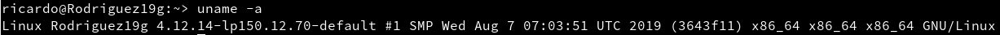

## 1.3. Habilitar el acceso a la red externa a los Contenedores

Para que nuestro contenedor tenga acceso a la red exterior activaremos el IP_FORWARD

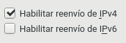

# 2. Instalación y primeras pruebas.

## 2.1. Instalación

Vamos a instalar docker
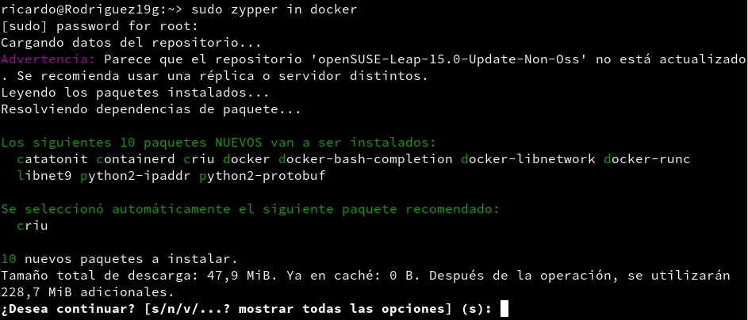

Ahora activaremos el servicio de docker.

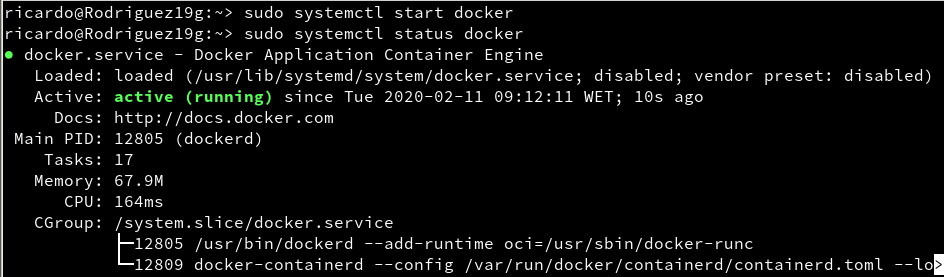

Vamos a comprobar la versiones de docker

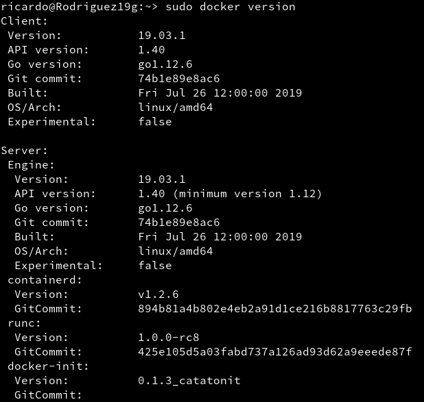

## 2.2. Primera prueba

Comprobamos que no tenemos imágenes creadas.

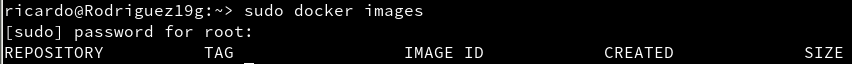

Comprobamos que no tenemos contenedores creados.

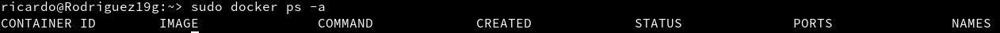

Vamos a descargar y ejecutar el contenedor con la imagen "Hello-word"

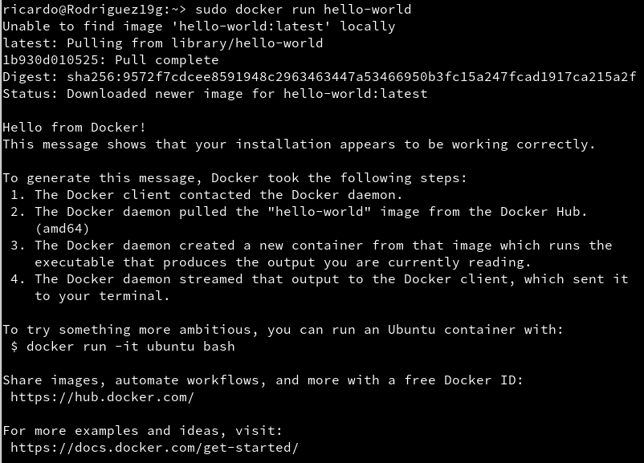

Comprobamos la nueva imagen.

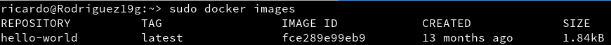

Comprobamos el estado del contenedor.

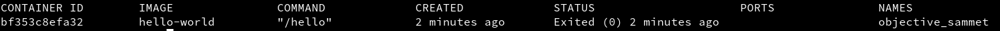

## 2.3. Información

| Comando                     | Descripción |
| --------------------------- | ------------------- |
| `docker stop CONTAINERID`   | parar un contenedor |
| `docker start CONTAINERID`  | iniciar un contenedor |
| `docker attach CONTAINERID` | conectar el terminal actual con el interior de contenedor |
| `docker ps`                 | mostrar los contenedores en ejecución |
| `docker ps -a`              | mostrar todos los contenedores (en ejecución o no) |
| `docker rm CONTAINERID`     | eliminar un contenedor |
| `docker rmi IMAGENAME`      | eliminar una imagen |

# 3. Creación manual

## 3.1. Crear una imagen manualmente

Buscamos una imagen de debian en los repositorios de Docker.

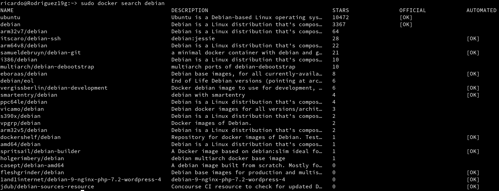

Descargamos una imagen 'debian:9'

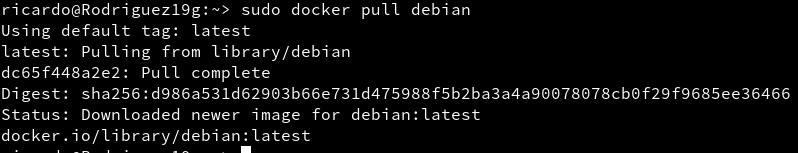

Comprobamos las imagenes descargadas.

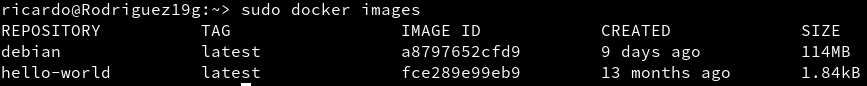

comprobamos los contenedores

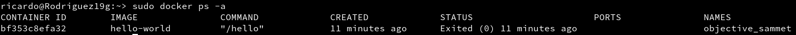

Comprobamos los contenedores solo en ejecución

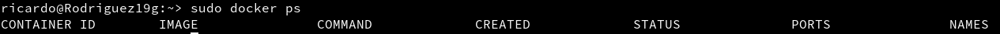

Ahora vamos a crear un contenedor con el nombre `con_debian` a partir de la imagen de `debian` que descargamos anteriormente, también ejecutaremos /bin/bash

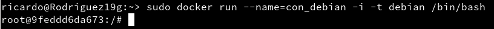

## 3.2. Personalizar el contenedor

Ahora que estamos dentro del contenedor vamos a personalizarlo.

Comprobamos primero que estamos en debian.

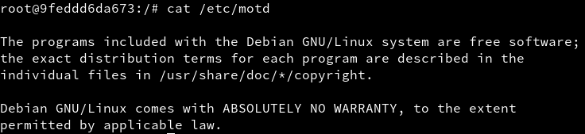

Ahora vamos a actualizar los repositorios.

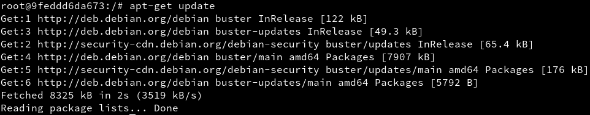

**Vamos a instalar Nginx y el editor de textos Vi**

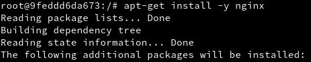
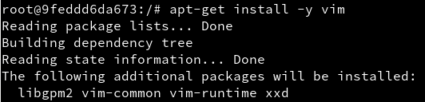

Iniciamos el servicio Nginx

Vamos a comprobar los procesos a ver si entre ellos encontramos Nginx.

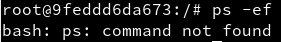

Vemos que no se ha encontrado el comando, vamos a probar a instalarlo.

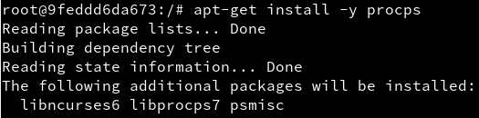

Comprobamos ahora si funciona.

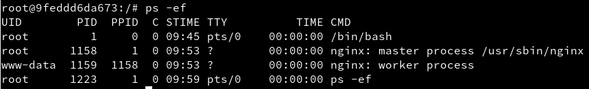

Ahora vamos a **crear un fichero HTML** para nuestro Nginx.

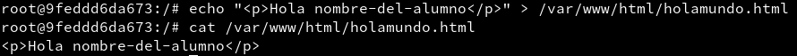

**Crearemos un script** que arranque Nginx por nosotros a la hora de arrancar el Docker.

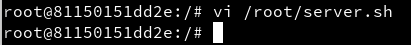

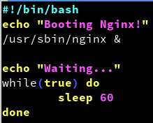

## 3.3. Crear una imagen a partir del contenedor

Ahora que tenemmos nuestro contendor con Nginx vamos a crear una imagen con los cambios que hemos realizado, para ello debemos buscar la ID del contenedor.

A partir de esta ID crearemos la nueva imagen.

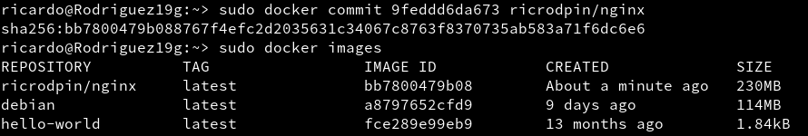

Ahora vamos a eliminar el contenedor, primero vamos a comprobar los contenedores activos, pararemos el contenedor debian, comprobamos que se ha parado y lo eliminamos.

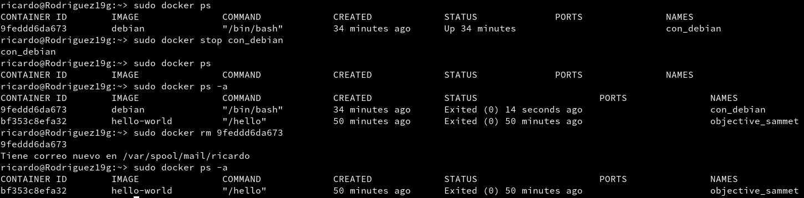

# 4. Crear contenedor a partir de nuestra imagen

## 4.1. Crear contenedor con Nginx

Tenemos nuestra imagen instalada ahora vamos a iniciarla, con el puerto 80 abierto para nginx.

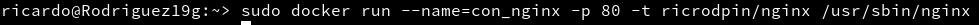

## 4.2. Buscar los puertos de salida

Buscamos los puertos que se corresponde de la maquina real con el puero 80 de nuestro docker con nginx

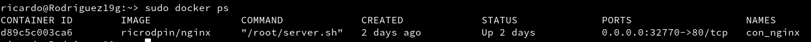

Ahora comprobamos si podemos acceder al servicio de Nginx

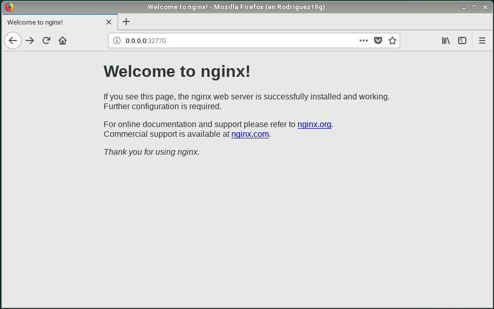

Ahora comprobamos si podemos acceder al fichero holamundo.html

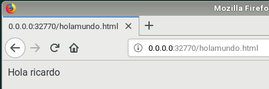

## 4.3 Migrar la imágen a otra máquina.

**Exportar** un Docker a un fichero tar

Ahora vamos a exportar nuestro docker para que otra persona pueda usarlo.

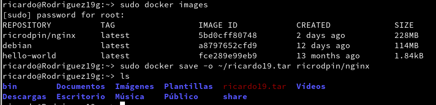

**Importar** un Docker desde un fichero tar.

Ahora vamos a tomar un docker de un compañero y lo vamos a importar.

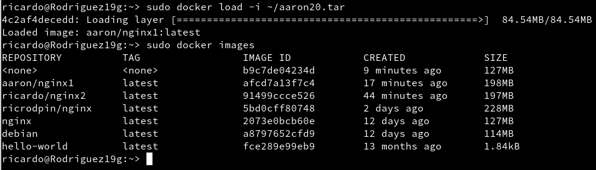

# 5. Dockerfile

## 5.1. Preparar ficheros

Crearemos el directorio `/home/ricardo/docker19a`, en el pondremos una copia del fichero `holamundo.html` y una copia del fichero `server.sh`

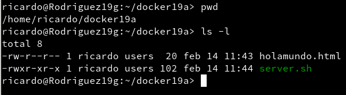

Ahora crearemos el fichero `Dockerfile` con el siguiente contenido.

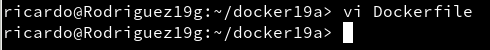

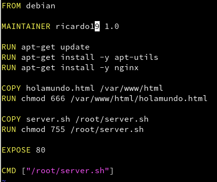

## 5.2. Crear imagen a partir del Dockerfile

Vamos a construir la nueva imagen a partir del Dockerfile

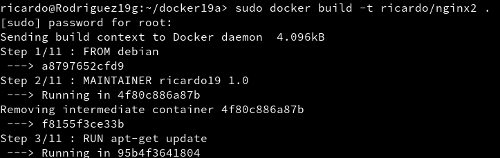

Comprobamos que se ha creado y que aparece en la lista de imagenes de docker que tenemos.

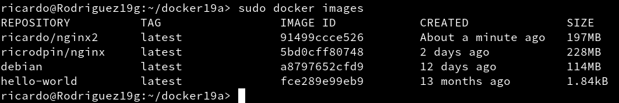

## 5.3. Crear contenedor y comprobar

Ahora crearemos un contenedor a partir de la imagen creada anteriormente

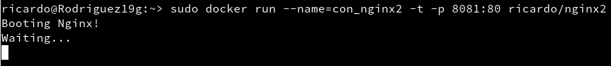

Ahora vamos a averiguar que puerto escucha el servidor nginx y comprobamos la conexión en el navegador

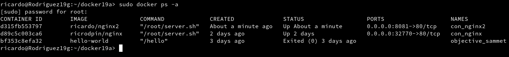

vemos que el puerto 8081 de la máquina se corresponde al puerto del Docker

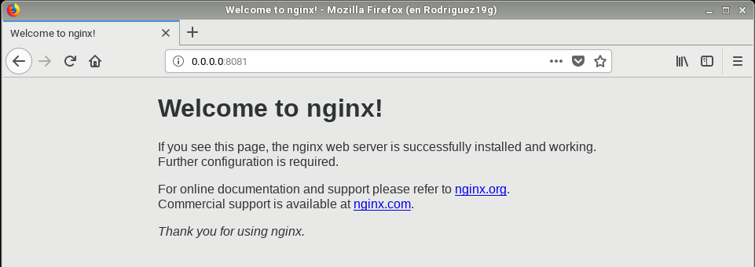

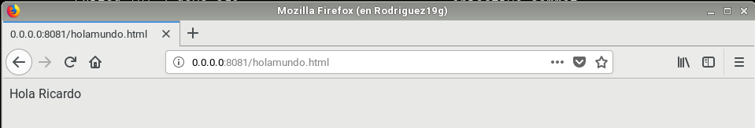

## 5.4. Usar imágenes ya creadas

{ Falta Por Arreglar }

Vamos a crear el directorio `docker19b` y crearemos el siguiente `Dockerfile`

Creamos la imagen.

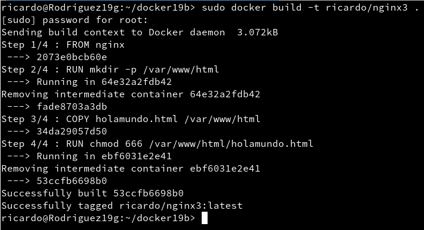

Comprobamos la imagen.

Iniciamos el contendor.

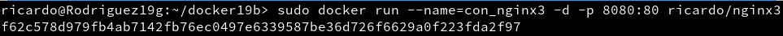

Comprobamos los contenedores que tenemos activos.

Ahora comprobamos si el servidor web esta funcionando.

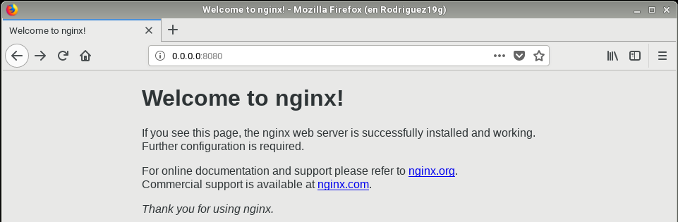

Ahora comprobamos si podemos acceder al fichero `holamundo.html` que hemos creado para este contenedor

# 6. Limpiar contenedores e imágenes
