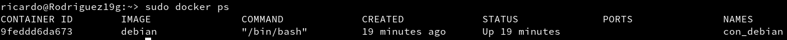
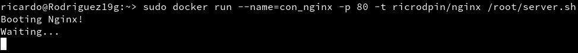

# 1. Contenedores con Docker

## 1.1. Introducción

Esta herramienta nos permite crear lo que ellos denominan contenedores, lo cual son aplicaciones empaquetadas auto-suficientes, muy livianas, que son capaces de funcionar en prácticamente cualquier ambiente, ya que tiene su propio sistema de archivos, librerías, terminal, etc.

## 1.2. Requisitos

* Vamos a usar OpenSUSE
* Kernel 3.10 o Superior(`uname -a`)

## 1.3. Habilitar el acceso a la red externa a los Contenedores

Para que nuestro contenedor tenga acceso a la red exterior activaremos el IP_FORWARD

# 2. Instalación y primeras pruebas.

## 2.1. Instalación

Vamos a instalar docker

Ahora activaremos el servicio de docker.

Vamos a comprobar la versiones de docker

## 2.2. Primera prueba

Comprobamos que no tenemos imágenes creadas.

Comprobamos que no tenemos contenedores creados.

Vamos a descargar y ejecutar el contenedor con la imagen "Hello-word"

Comprobamos la nueva imagen.

Comprobamos el estado del contenedor.

## 2.3. Información

| Comando                     | Descripción |
| --------------------------- | ------------------- |
| `docker stop CONTAINERID`   | parar un contenedor |
| `docker start CONTAINERID`  | iniciar un contenedor |
| `docker attach CONTAINERID` | conectar el terminal actual con el interior de contenedor |
| `docker ps`                 | mostrar los contenedores en ejecución |
| `docker ps -a`              | mostrar todos los contenedores (en ejecución o no) |
| `docker rm CONTAINERID`     | eliminar un contenedor |
| `docker rmi IMAGENAME`      | eliminar una imagen |

# 3. Creación manual

## 3.1. Crear una imagen manualmente

Buscamos una imagen de debian en los repositorios de Docker.

Descargamos una imagen 'debian:9'

Comprobamos las imagenes descargadas.

comprobamos los contenedores

Comprobamos los contenedores solo en ejecución

Ahora vamos a crear un contenedor con el nombre `con_debian` a partir de la imagen de `debian` que descargamos anteriormente, también ejecutaremos /bin/bash

## 3.2. Personalizar el contenedor

Ahora que estamos dentro del contenedor vamos a personalizarlo.

Comprobamos primero que estamos en debian.

Ahora vamos a actualizar los repositorios.

**Vamos a instalar Nginx y el editor de textos Vi**

Iniciamos el servicio Nginx

Vamos a comprobar los procesos a ver si entre ellos encontramos Nginx.

Vemos que no se ha encontrado el comando, vamos a probar a instalarlo.

Comprobamos ahora si funciona.

Ahora vamos a **crear un fichero HTML** para nuestro Nginx.

**Crearemos un script** que arranque Nginx por nosotros a la hora de arrancar el Docker.

## 3.3. Crear una imagen a partir del contenedor

Ahora que tenemmos nuestro contendor con Nginx vamos a crear una imagen con los cambios que hemos realizado, para ello debemos buscar la ID del contenedor.

A partir de esta ID crearemos la nueva imagen.

Ahora vamos a eliminar el contenedor, primero vamos a comprobar los contenedores activos, pararemos el contenedor debian, comprobamos que se ha parado y lo eliminamos.

# 4. Crear contenedor a partir de nuestra imagen

## 4.1. Crear contenedor con Nginx

Tenemos nuestra imagen instalada ahora vamos a iniciarla, con el puerto 80 abierto para nginx.

## 4.2. Buscar los puertos de salida

# 5. Crear un contenedor a partir de un Dockerfile

## 5.1. Comprobaciones iniciales

## 5.2. Preparar ficheros

## 5.3. Crear imagen a partir del Dockerfile

## 5.4. Crear contenedor y comprobar

# 6. Migrar las imágenes de Docker a otro servidor

## 6.1. Exportar

## 6.2. Importar

# 7. Limpiar
